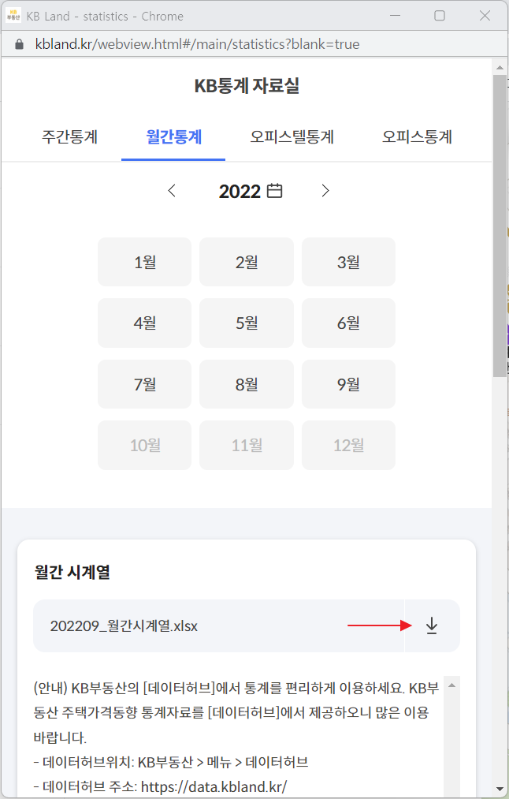

Data preprocessing is an indispensable step in data analysis. Unlike the textbook cases, real world data need an additional transformation and manipulation prior to actually performing the analysis.

In this post, I am going to showcase how I used **Python** and **Pandas Package** to tidy up the data obtained from `kbland.kr` , a leading financial institution that provides information about the real estate market. 

Codes were referenced from the book `파이썬을 활용한 부동산 데이터 분석 by 박준규`. Bit of adjustments were made to distinguish the code I have written down with the author's original code.

## Download the web data

`kbland.kr` provides various types of data. The primary data to be used in this post will the monthly data, which can be downloaded as shown below.




## Import necessary packages

In this post `pandas` and `xlwings` will be used to perform our data preprocessing steps. Pandas is a well know package that allows users to manipulate data in a spreadsheet-like table format. While pandas provides methods to import data source in various types, I have found out  `xlwings` package to be much more useful when manipulating excel format data in Python.

For more information visit the official documentation for both pandas and xlwings

* https://pandas.pydata.org/docs/index.html
* https://docs.xlwings.org/en/stable/


```python
import pandas as pd
import xlwings as xw
```

For better readability in Jupyter Notebook, display options were adjusted as below. 

```python
pd.options.display.float_format = '{:.2f}'.format
```


## Load the data


```python
path = "./rawdata/202209_월간시계열.xlsx"
wb = xw.Book(path)
sheet = wb.sheets['1.매매종합']
```


```python
row_num = sheet.range(1,1).end('down').end('down').end('down').row
data_range = 'A2:GE' + str(row_num)
print(data_range)
```

    A2:GE449


```python
raw_data = sheet[data_range].options(pd.DataFrame, index=False, header = True).value
raw_data.head(2)
```


<div>
<style scoped>
    .dataframe tbody tr th:only-of-type {
        vertical-align: middle;
    }


    .dataframe tbody tr th {
        vertical-align: top;
    }
    
    .dataframe thead th {
        text-align: right;
    }

</style>

<table border="1" class="dataframe">
  <thead>
    <tr style="text-align: right;">
      <th></th>
      <th>구분</th>
      <th>전국</th>
      <th>서울</th>
      <th>강북\n14개구</th>
      <th>None</th>
      <th>None</th>
      <th>None</th>
      <th>None</th>
      <th>None</th>
      <th>None</th>
      <th>...</th>
      <th>None</th>
      <th>None</th>
      <th>양산</th>
      <th>거제</th>
      <th>진주</th>
      <th>김해</th>
      <th>통영</th>
      <th>제주도</th>
      <th>제주/\n서귀포</th>
      <th>기타지방</th>
    </tr>
  </thead>
  <tbody>
    <tr>
      <th>0</th>
      <td>None</td>
      <td>None</td>
      <td>None</td>
      <td>None</td>
      <td>강북구</td>
      <td>광진구</td>
      <td>노원구</td>
      <td>도봉구</td>
      <td>동대문구</td>
      <td>마포구</td>
      <td>...</td>
      <td>의창구</td>
      <td>진해구</td>
      <td>None</td>
      <td>None</td>
      <td>None</td>
      <td>None</td>
      <td>None</td>
      <td>None</td>
      <td>None</td>
      <td>None</td>
    </tr>
    <tr>
      <th>1</th>
      <td>Classification</td>
      <td>Total</td>
      <td>Seoul</td>
      <td>Northern seoul</td>
      <td>Gangbuk-gu</td>
      <td>Gwangjin-gu</td>
      <td>Nowon-gu</td>
      <td>Dobong-gu</td>
      <td>Dongdaemun-gu</td>
      <td>Mapo-gu</td>
      <td>...</td>
      <td>Uichang</td>
      <td>Jinhae</td>
      <td>Yangsan</td>
      <td>Geoje</td>
      <td>Jinju</td>
      <td>Gimhae</td>
      <td>Tongyoung</td>
      <td>Jeju-do</td>
      <td>Jeju/\nSeogwipo</td>
      <td>Non-Metropolitan Area</td>
    </tr>
  </tbody>
</table>
<p>2 rows × 187 columns</p>

</div>

The last 4 rows, which is irrelevant to our data analysis, will be dropped.


```python
raw_data['구분'].tail(4)
```

```
443    『데이터허브』에서 KB부동산 통계를 편리하게 이용하세요
444                KB부동산 > 메뉴 > 데이터허브
445                             데이터허브
446                            주택가격동향
Name: 구분, dtype: object
```


```python
raw_data.drop(raw_data.tail(4).index, inplace=True)
```


## Combining two fragmented columns into one multi-Index column

The column row and the first row ~~of the data frame~~ contain the label information of the region and the region's corresponding sub-districts.

These two rows will be combined into one multi-Index columns and dropped to avoid redundancy.


```python
big_col = list(raw_data.columns) # Header column
small_col = list(raw_data.iloc[0]) # the first row
```


```python
bignames = pd.Series(big_col).unique().tolist()
```


```python
print(bignames) # List of the regions
```

    ['구분', '전국', '서울', '강북\n14개구', None, '강남\n11개구', '6개광역시', '부산', '대구', '인천', '광주', '대전', '울산', '5개광역시\n(인천外)', '수도권', '세종', '경기', '수원', '성남', '고양', '안양', '부천', '의정부', '광명', '평택', '안산', '과천', '구리', '남양주', '용인', '시흥', '군포', '의왕', '하남', '오산', '파주', '이천', '안성', '김포', '양주', '동두천', '화성', '강원', '춘천', '원주', '충북', '청주', '충주', '제천', '충남', '천안', '공주', '아산', '논산', '계룡', '당진', '서산', '전북', '전주', '익산', '군산', '전남', '목포', '순천', '광양', '여수', '경북', '포항', '구미', '경산', '안동', '김천', '경남', '창원', '양산', '거제', '진주', '김해', '통영', '제주도', '제주/\n서귀포', '기타지방']

Among the list of regions to be included as th column header, below three elements will be erased as they deem redundant or meaningless.

```python
bignames.remove(None)
bignames.remove("강북\n14개구")
bignames.remove("강남\n11개구")
```


```python
for num, gu_data in enumerate(small_col):
    if gu_data == None:
        small_col[num] = big_col[num]
    check = num
    while True:
        if big_col[check] in bignames:
            big_col[num] = big_col[check]
            break
        else:
            check = check - 1
```


```python
# Designating raw_data's column
raw_data.columns = [big_col, small_col]
```


```python
raw_data.drop([0,1], inplace=True)
```


```python
raw_data.head(2)
```


<div>
<style scoped>
    .dataframe tbody tr th:only-of-type {
        vertical-align: middle;
    }


    .dataframe tbody tr th {
        vertical-align: top;
    }
    
    .dataframe thead tr th {
        text-align: left;
    }

</style>

<table border="1" class="dataframe">
  <thead>
    <tr>
      <th></th>
      <th>구분</th>
      <th>전국</th>
      <th colspan="8" halign="left">서울</th>
      <th>...</th>
      <th colspan="2" halign="left">창원</th>
      <th>양산</th>
      <th>거제</th>
      <th>진주</th>
      <th>김해</th>
      <th>통영</th>
      <th>제주도</th>
      <th>제주/\n서귀포</th>
      <th>기타지방</th>
    </tr>
    <tr>
      <th></th>
      <th>구분</th>
      <th>전국</th>
      <th>서울</th>
      <th>강북\n14개구</th>
      <th>강북구</th>
      <th>광진구</th>
      <th>노원구</th>
      <th>도봉구</th>
      <th>동대문구</th>
      <th>마포구</th>
      <th>...</th>
      <th>의창구</th>
      <th>진해구</th>
      <th>양산</th>
      <th>거제</th>
      <th>진주</th>
      <th>김해</th>
      <th>통영</th>
      <th>제주도</th>
      <th>제주/\n서귀포</th>
      <th>기타지방</th>
    </tr>
  </thead>
  <tbody>
    <tr>
      <th>2</th>
      <td>86.10</td>
      <td>27.68</td>
      <td>23.47</td>
      <td>32.59</td>
      <td>None</td>
      <td>None</td>
      <td>None</td>
      <td>None</td>
      <td>None</td>
      <td>None</td>
      <td>...</td>
      <td>None</td>
      <td>None</td>
      <td>None</td>
      <td>None</td>
      <td>None</td>
      <td>None</td>
      <td>None</td>
      <td>None</td>
      <td>None</td>
      <td>None</td>
    </tr>
    <tr>
      <th>3</th>
      <td>2.00</td>
      <td>27.68</td>
      <td>23.47</td>
      <td>32.55</td>
      <td>None</td>
      <td>None</td>
      <td>None</td>
      <td>None</td>
      <td>None</td>
      <td>None</td>
      <td>...</td>
      <td>None</td>
      <td>None</td>
      <td>None</td>
      <td>None</td>
      <td>None</td>
      <td>None</td>
      <td>None</td>
      <td>None</td>
      <td>None</td>
      <td>None</td>
    </tr>
  </tbody>
</table>
<p>2 rows × 187 columns</p>

</div>

Now the columns are nicely tidied up, the index of the data frame 
need to be tidied up.


## Converting the data frame index into uniform time structure

Current Index is not in a structured way as shown below. Simple string manipulation is done to match each index value into `%Y-%m-%d` format. After the manipulation is done the redundant column `(('구분', '구분'))` is dropped from the data frame.

```python
raw_data['구분']['구분'].values[:24]
```

```
array([86.1, 2.0, 3.0, 4.0, 5.0, 6.0, 7.0, 8.0, 9.0, 10.0, 11.0, 12.0,
       87.1, 2.0, 3.0, 4.0, 5.0, 6.0, 7.0, 8.0, 9.0, 10.0, 11.0, 12.0],
      dtype=object)
```


```python
index_list = list(raw_data['구분']['구분'])

new_index = list()

for num, raw_index in enumerate(index_list):
    temp = str(raw_index).split('.')
    if int(temp[0]) > 12:
        if len(temp[0]) == 2:
            new_index.append('19' + temp[0] + '.' + temp[1])
        else:
            new_index.append(temp[0] + '.' + temp[1])
    else:
        new_index.append(new_index[num-1].split('.')[0] + '.' + temp[0])
```


```python
raw_data.set_index(pd.to_datetime(new_index), inplace=True)
```


```python
clean_data = raw_data.drop(('구분','구분'), axis = 1)
```


```python
clean_data.head(2)
```


<div>
<style scoped>
    .dataframe tbody tr th:only-of-type {
        vertical-align: middle;
    }


    .dataframe tbody tr th {
        vertical-align: top;
    }
    
    .dataframe thead tr th {
        text-align: left;
    }

</style>

<table border="1" class="dataframe">
  <thead>
    <tr>
      <th></th>
      <th>전국</th>
      <th colspan="9" halign="left">서울</th>
      <th>...</th>
      <th colspan="2" halign="left">창원</th>
      <th>양산</th>
      <th>거제</th>
      <th>진주</th>
      <th>김해</th>
      <th>통영</th>
      <th>제주도</th>
      <th>제주/\n서귀포</th>
      <th>기타지방</th>
    </tr>
    <tr>
      <th></th>
      <th>전국</th>
      <th>서울</th>
      <th>강북\n14개구</th>
      <th>강북구</th>
      <th>광진구</th>
      <th>노원구</th>
      <th>도봉구</th>
      <th>동대문구</th>
      <th>마포구</th>
      <th>서대문구</th>
      <th>...</th>
      <th>의창구</th>
      <th>진해구</th>
      <th>양산</th>
      <th>거제</th>
      <th>진주</th>
      <th>김해</th>
      <th>통영</th>
      <th>제주도</th>
      <th>제주/\n서귀포</th>
      <th>기타지방</th>
    </tr>
  </thead>
  <tbody>
    <tr>
      <th>1986-01-01</th>
      <td>27.68</td>
      <td>23.47</td>
      <td>32.59</td>
      <td>None</td>
      <td>None</td>
      <td>None</td>
      <td>None</td>
      <td>None</td>
      <td>None</td>
      <td>None</td>
      <td>...</td>
      <td>None</td>
      <td>None</td>
      <td>None</td>
      <td>None</td>
      <td>None</td>
      <td>None</td>
      <td>None</td>
      <td>None</td>
      <td>None</td>
      <td>None</td>
    </tr>
    <tr>
      <th>1986-02-01</th>
      <td>27.68</td>
      <td>23.47</td>
      <td>32.55</td>
      <td>None</td>
      <td>None</td>
      <td>None</td>
      <td>None</td>
      <td>None</td>
      <td>None</td>
      <td>None</td>
      <td>...</td>
      <td>None</td>
      <td>None</td>
      <td>None</td>
      <td>None</td>
      <td>None</td>
      <td>None</td>
      <td>None</td>
      <td>None</td>
      <td>None</td>
      <td>None</td>
    </tr>
  </tbody>
</table>
<p>2 rows × 186 columns</p>

</div>

After all the manipulation is done with the current data frame, the data frame has a much better readability. However, in its pivot table format, it is still hard to store and filter out specific data of interest. By using the Pandas method `melt()`, it is easy to transform the data table in the desired format. In this case multi-indexed columns will be transformed to compose a value in each row under the variable name **Region** and **District**.


```python
clean_data2 = clean_data.melt(ignore_index = False)
clean_data2.rename(columns = {"variable_0":"Region", "variable_1":"District"}, inplace = True)
```

Now we can filter out specific region of interest from the preprocessed data frame, in this case **서울**.


```python
clean_data2[clean_data2["Region"] == "서울"]
```


<div>
<style scoped>
    .dataframe tbody tr th:only-of-type {
        vertical-align: middle;
    }


    .dataframe tbody tr th {
        vertical-align: top;
    }
    
    .dataframe thead th {
        text-align: right;
    }

</style>

<table border="1" class="dataframe">
  <thead>
    <tr style="text-align: right;">
      <th></th>
      <th>Region</th>
      <th>District</th>
      <th>value</th>
    </tr>
  </thead>
  <tbody>
    <tr>
      <th>1986-01-01</th>
      <td>서울</td>
      <td>서울</td>
      <td>23.47</td>
    </tr>
    <tr>
      <th>1986-02-01</th>
      <td>서울</td>
      <td>서울</td>
      <td>23.47</td>
    </tr>
    <tr>
      <th>1986-03-01</th>
      <td>서울</td>
      <td>서울</td>
      <td>23.44</td>
    </tr>
    <tr>
      <th>1986-04-01</th>
      <td>서울</td>
      <td>서울</td>
      <td>23.31</td>
    </tr>
    <tr>
      <th>1986-05-01</th>
      <td>서울</td>
      <td>서울</td>
      <td>23.12</td>
    </tr>
    <tr>
      <th>...</th>
      <td>...</td>
      <td>...</td>
      <td>...</td>
    </tr>
    <tr>
      <th>2022-05-01</th>
      <td>서울</td>
      <td>영등포구</td>
      <td>100.48</td>
    </tr>
    <tr>
      <th>2022-06-01</th>
      <td>서울</td>
      <td>영등포구</td>
      <td>100.71</td>
    </tr>
    <tr>
      <th>2022-07-01</th>
      <td>서울</td>
      <td>영등포구</td>
      <td>100.90</td>
    </tr>
    <tr>
      <th>2022-08-01</th>
      <td>서울</td>
      <td>영등포구</td>
      <td>100.96</td>
    </tr>
    <tr>
      <th>2022-09-01</th>
      <td>서울</td>
      <td>영등포구</td>
      <td>100.94</td>
    </tr>
  </tbody>
</table>
<p>12348 rows × 3 columns</p>

</div>

(The End)
